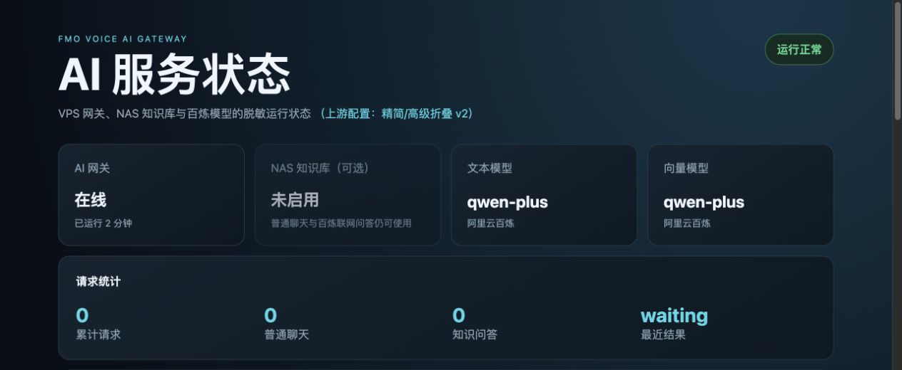
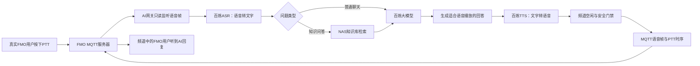

# 项目初衷、目标与实现方案

## 一句话介绍

FMO AI Voice Gateway 是连接 **FMO MQTT语音服务器** 和 **阿里云百炼AI能力** 的中间网关。

它不改变FMO原有客户端、服务器和SAS/CA鉴权体系，而是在服务器旁边增加一个受控的“AI电台值守员”：听取频道中的语音，理解问题，生成回答，再在频道空闲时用语音回复。

本项目最早在FMO服务器“BH1JSS机婶婶测试台”上落地验证。测试台由BH1JSS维护，AI使用 `AI-BH1JSS` 作为独立发言标识，主要服务于普通聊天、无线电知识问答、FMO仪表盘与HAM台网点名控制台帮助，以及NAS设备说明书检索。它是AI实验服务，不是真实持证呼号，也不绕过FMO服务器原有鉴权。



> 截图为脱敏界面展示，不包含任何API Key、Token、密码、服务器地址或实时用户数据。

## 🚀 最简单的安装方法

> [!IMPORTANT]
> 本项目提供GitHub自动安装脚本。它会自动获取最新Release、下载压缩包和SHA-256文件、校验完整性、解压并启动中文配置向导。

在Linux服务器执行以下两条命令，无需登录GitHub：

```bash
curl -fsSL https://raw.githubusercontent.com/54dashayu/fmo-ai-voice-gateway-installer/main/install.sh -o /tmp/fmo-ai-install.sh
sh /tmp/fmo-ai-install.sh
```

如果已经把公开安装脚本放到服务器，只需一条命令：

```bash
sh install.sh
```

安装结束后不会自动开放真实语音发射。管理员仍需按照本文后面的只读、模拟和真实PTT三个阶段完成验证。

## 为什么要做这个项目

传统FMO语音服务器主要解决三件事：用户登录、语音转发和通话管理。它能让不同地点的真实FMO用户进入同一服务器交流，但本身不会理解谈话内容，也不能自动回答问题。

这个项目最初希望在不破坏现有FMO服务的前提下，增加以下能力：

- 没有管理员在线时，也能回答常见的无线电知识问题。
- 帮助用户了解FMO仪表盘、HAM台网点名控制台等软件的使用方法。
- 检索服务器管理员整理的电台说明书、软件文档和知识库。
- 支持没有固定唤醒词的普通聊天，让交流更自然。
- 在需要时进行整点报时、夜间提示和服务器状态播报。
- 把这套能力从一台服务器上的定制程序，整理成可以配置、安装和复用的产品。

因此，这不是重新制作一套FMO，也不是绕过SAS/CA创建虚假用户，而是为已有FMO MQTT语音链路增加一个权限受控的AI服务端组件。

## 项目目标

### 1. 让FMO语音可以进入AI处理链路

网关订阅FMO服务器使用的MQTT语音主题，识别一段真人讲话何时开始、何时结束，并把音频交给ASR转换为文字。

这里的ASR可以理解为“语音听写员”。本项目统一使用阿里云百炼提供的语音识别能力。

### 2. 同时支持普通聊天和知识问答

系统根据问题内容选择处理方式：

- **普通聊天**：直接交给百炼大模型回答。
- **知识问答**：先从NAS知识库查找相关资料，再让模型依据资料组织答案。
- **无线电知识补充**：知识库没有可靠结果时，可以按后台策略使用百炼联网检索能力补充，但需要明确这是外部检索结果，不能伪装成知识库原文。

用户不必每次说固定唤醒词。普通语音可以进入聊天模式，包含设备、软件、说明书或无线电知识的问题则优先进入知识问答模式。

### 3. 把文字答案变成适合频道播放的语音

大模型生成回答后，由百炼TTS转换成音频。TTS可以理解为“语音播音员”。系统需要控制语音性别、音色、语速、口音或表达风格，并限制单次回复的播放时长。

### 4. 安全地进行PTT回复

AI不能像网页聊天一样随时输出。它需要遵守语音频道的使用规则：

- 等真人松开PTT并确认频道空闲。
- 避免与正在通话的用户同时发射。
- 在音频开头增加很短的保护静音，避免第一个字被削掉。
- 回复结束后保留很短的尾部时间，再释放PTT。
- 达到输入或回复时长上限时安全结束。
- 始终提供网页和语音紧急关闭能力。

### 5. 做成可以复用的网关产品

管理员应通过网页表单完成配置，不必手写JSON。产品化配置主要分为三部分：

1. 上游AI：百炼API Key、聊天模型、ASR、TTS和向量模型。
2. 下游FMO：一个或多个MQTT服务器地址、端口、主题和Client ID。
3. 可选知识库：NAS知识服务地址、访问Token、超时和返回结果数量。

不同服务器可以使用不同配置，敏感凭据只保存在服务器本地，不写入Git仓库，也不由管理页面返回明文。

## 不打算做什么

为了避免对现有FMO体系造成误解，本项目明确不做以下事情：

- 不替代FMO客户端、MQTT Broker或SAS/CA鉴权系统。
- 不自动修改现有EMQX、Nginx、MySQL、Trojan或其他业务服务。
- 不让AI冒充某个真实、在线的业余无线电呼号。
- 不承诺模型回答一定正确，关键操作和法规问题仍需人工核对。
- 不以后台出现“发送成功”作为真实通话成功的唯一证据。
- 不默认长期保存用户原始语音。

## 当前实现到什么程度

下面区分“已经具备的基础”和“仍需继续完成的产品目标”，避免把设计方案误认为全部已经上线：

| 能力 | 当前状态 | 说明 |
|---|---|---|
| 百炼文本、ASR、TTS配置 | 已具备 | 统一使用阿里云百炼，不设置其他模型供应商回退 |
| FMO MQTT语音监听与回复链路 | 已具备基础 | 真实PTT仍必须由部署者完成分级验证后开启 |
| 普通聊天与知识问答分流 | 已具备 | NAS关闭或没有命中时可按策略使用百炼回答 |
| NAS知识库 | 可选 | 需要单独部署知识服务并建立文档索引 |
| 状态页与表单配置 | 已具备 | 密钥只显示配置状态，不返回明文 |
| 黑名单、呼号统计、功能开关 | 已具备 | 是否真实生效仍应在目标服务器完成验收 |
| Linux一键安装与GitHub自动下载 | 已具备 | 安装后所有高风险开关保持关闭 |
| 多MQTT配置结构 | 已具备基础 | 当前运行链路以一个主服务器为主 |
| 多服务器同时监听与分别回复 | 后续目标 | 仍需增加连接隔离、独立状态、回复路由和冲突控制 |
| 完全自动训练大模型 | 不采用 | 私有知识优先通过RAG更新，不把通话直接用于自动训练 |

## 整体业务链路



## 每个组件分别负责什么

| 组件 | 通俗解释 | 主要职责 |
|---|---|---|
| FMO MQTT服务器 | 语音交换台 | 转发FMO用户和AI网关的语音数据 |
| SAS/CA | 门禁系统 | 决定真实FMO客户端能否进入服务器及使用哪些主题 |
| MQTT监听与编码层 | 收音机接口 | 收集、解析和重新封装FMO语音帧 |
| 百炼ASR | 听写员 | 把呼入语音转换为文字 |
| 路由与规则层 | 值班调度员 | 判断聊天、知识问答、语音命令或标准通联 |
| NAS知识库 | 本地资料室 | 保存软件文档、电台说明书和管理员资料 |
| 百炼LLM | 回答组织者 | 理解问题并生成自然语言答案 |
| 百炼TTS | 播音员 | 把答案合成为可播放语音 |
| PTT时序控制 | 发射控制员 | 等待频道空闲、保护首字、控制发射与结束 |
| AI管理页面 | 控制台 | 查看状态、修改配置、开关功能、管理黑名单和知识库 |

## 技术实现路径

### 第一步：只读接入FMO MQTT

先让网关以只读方式连接目标Broker和语音主题，只确认以下事实：

- MQTT地址、端口和主题是否正确。
- AI网关是否收到预期语音帧。
- 是否能区分呼号、UID、PTT开始与结束。
- 接入过程是否影响已有FMO用户和SAS/CA鉴权。

这个阶段不发布语音、不触发PTT，也不采集无关用户的完整录音。

### 第二步：完成离线AI闭环

使用管理员自己的短测试音频验证：

```text
测试音频 -> 百炼ASR -> 文本路由 -> 百炼LLM -> 百炼TTS -> 本地音频
```

生成的音频只在本地试听。这个阶段可以检查识别率、回答内容、音色、时长和首字保护，但仍不向FMO频道发射。

### 第三步：约束条件下的真实语音验证

经过明确授权后，只对约定服务器、约定呼号和短语音测试真实PTT。验证成功必须同时满足：

- 后台能看到正确的收发状态。
- MQTT发布过程没有错误。
- 频道另一端实际听到完整回复。
- 第一个字和最后一个字没有被切掉。
- 没有打断其他用户或抢占繁忙频道。

### 第四步：增加对话、知识库和管理能力

基础语音链路稳定后，再逐步增加普通聊天、RAG知识问答、联网补充、人格设置、语音命令、黑名单、呼号统计、报时和夜间提示。每项能力有独立开关，避免一个总开关同时放开所有风险。

### 第五步：多服务器与产品化配置

把MQTT连接、百炼模型和NAS知识库从代码中抽离为配置。这样迁移到另一台FMO服务器时，主要修改连接参数和授权关系，不需要复制或重写核心代码。

## 对话处理策略

### 普通聊天

普通聊天允许比较自然、轻松的交流，但回答仍需遵守适用法律法规和服务端内容规范。模型应明确自己是AI语音服务，不冒充真实操作员。

### 知识问答

知识问答采用RAG方式。RAG的含义是“先查资料，再回答”：

1. 把问题转换为便于检索的向量。
2. 在NAS中查找最相关的文档片段。
3. 把问题和片段一起交给百炼模型。
4. 模型根据资料生成适合口语播放的答案。

这种方式不是重新训练大模型，也不会让模型永久记住所有通话。更新知识通常只需增加或替换NAS文档，再重新建立索引。

### 标准无线电通联

如果语音中出现CQ、呼号、字母解释法、73等明显通联元素，系统应优先采用业余无线电通联方式回应：

- 正确称呼对方呼号。
- 简洁确认收到的信息。
- 不捏造未测量的信号报告。
- 表明AI身份标识。
- 避免用过长回答占用频道。

### 语音命令

语音命令与普通聊天分开处理。命令需要命中约定句式和相似度阈值，执行成功后播放提示音。自动回复开关可以按配置开放，其他管理命令应依据权限策略限制呼号，并始终拒绝黑名单用户。

## 部署策略

### 推荐：AI网关与MQTT同机部署

如果AI网关和EMQX位于同一台阿里云ECS，网关可连接仅监听回环地址的MQTT端口，例如 `127.0.0.1`。这样AI语音流量无需绕行公网，也不会把AI专用管理端口暴露出去。

公网FMO客户端使用的端口与AI内部端口可以不同，不能简单把网页上看到的内部地址提供给普通FMO用户。

### 远程MQTT服务器

网关也可以连接其他经过合法授权的FMO MQTT服务器。对方需要提供实际连接参数和相应SAS/ACL权限；AI自身的回复时长、人格、黑名单和知识库策略仍由AI管理后台控制。

### NAS知识库是可选项

家中NAS没有公网IP时，可以通过受控虚拟网络、反向隧道或其他加密私网连接。NAS不可达时，网关应降级到普通百炼回答，而不是阻塞整个语音服务。

## 安全与隐私策略

### 凭据安全

- 百炼API Key、MQTT密码、NAS Token和证书只写入权限受限的服务器配置。
- 网页读取配置时只显示“已配置”，不返回原始密钥。
- 日志、Git提交、安装包和诊断输出均不得包含凭据明文。

### 语音数据

- 默认不长期保存原始语音。
- 调试录音设置自动过期、数量或容量限制。
- 只在管理员授权的诊断范围内捕获测试语音。
- 知识库调用统计与呼号统计不等于保存完整谈话内容。

### 发射安全

所有真实发射能力在安装后默认关闭。启用顺序应为：

1. AI文本网关。
2. 只读MQTT监听。
3. ASR测试。
4. TTS本地试听。
5. 模拟完整闭环。
6. 约定条件下的真实PTT。
7. 自动回复和定时播报。

网页健康状态只能证明服务进程正常，不能证明真实频道已经收到语音。

## 可维护与回退策略

- 使用专用 `fmo-ai` Linux用户运行服务。
- 程序、配置和运行数据分别存放，升级时不覆盖现有密钥和业务状态。
- systemd负责自动启动和故障重启。
- 一键安装脚本只提供EMQX和Nginx配置示例，不直接覆盖现网主配置。
- 每次升级先备份配置和服务单元，失败时可以恢复旧程序目录。
- GitHub Release同时提供压缩包和SHA-256文件，自动安装脚本必须校验后才执行。

## 如何判断项目真正可用

不能只看“服务已启动”或“MQTT已发布”。完整验收至少包括：

- 原有FMO用户仍能正常登录和通话。
- AI开关关闭时绝不自动回复或报时。
- ASR能识别管理员约定的短测试语音。
- 普通聊天和知识问答能正确分流。
- 知识库答案可以追溯到相关资料。
- TTS音色与后台设置一致，回复不超过配置时长。
- 真人松开PTT后，AI在合理时间内开始发射。
- 接收端能听到完整首字和尾字。
- 频道繁忙时AI会等待或放弃，不会抢占。
- 黑名单、呼号统计、网页开关和语音开关真实生效。

## 最终希望形成的产品

最终产品不是一段只能运行在BH1JSS服务器上的脚本，而是一套可安装、可配置、可观察、可关闭和可回退的FMO AI语音网关：

- 上游统一使用阿里云百炼提供AI能力。
- 下游可按授权连接一个或多个FMO MQTT语音服务器。
- 管理员用网页完成日常配置，不必修改代码。
- NAS知识库可选，适合保存私有软件文档和设备说明书。
- 所有高风险语音发射能力都有独立门禁。
- 安装包、自动更新入口、说明文档和验证流程可以被其他服务器管理员复用。

这个项目的核心原则可以概括为：**先保证原有FMO服务不受影响，再让AI听懂；先在本地证明回答正确，再让它谨慎发言。**
